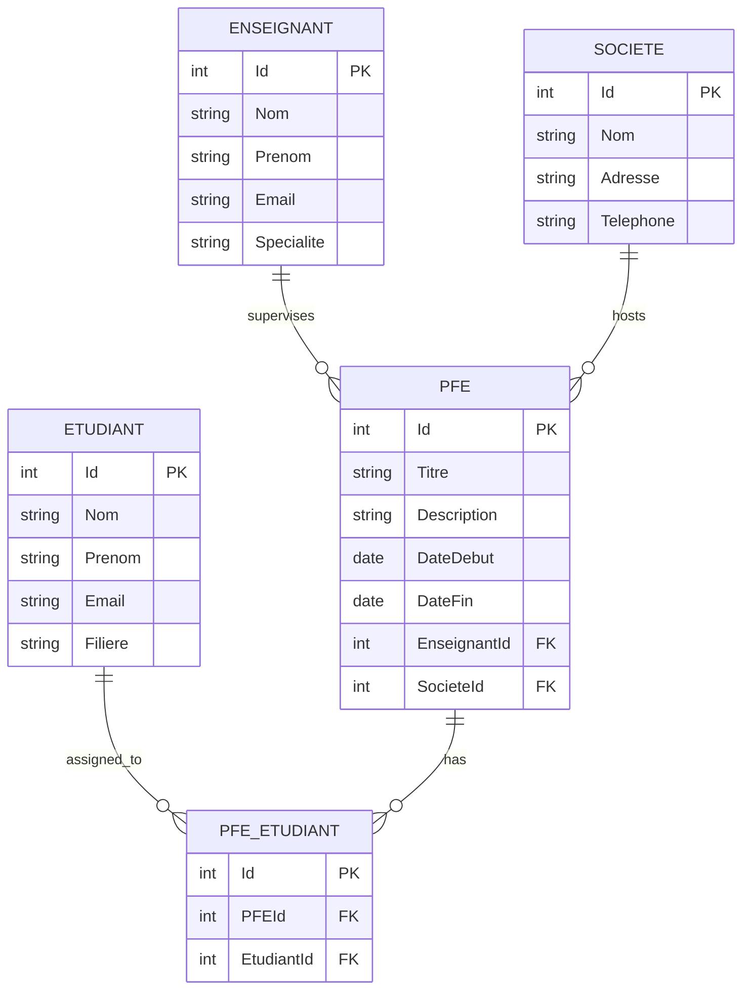

# 🎓 GestSoutenance

<div align="center">


**[Français](#-français) | [English](#-english)**

</div>

---

## 🇫🇷 Français

### 📋 Description

**GestSoutenance** est une application web ASP.NET Core MVC complète pour la gestion des soutenances de Projets de Fin d'Études (PFE). Elle permet aux établissements d'enseignement de gérer efficacement les étudiants, les enseignants, les entreprises partenaires et les projets de fin d'études.

### ✨ Fonctionnalités

| Module                         | Description                                                                   |
| ------------------------------ | ----------------------------------------------------------------------------- |
| 👨‍🎓 **Gestion des Étudiants**   | CRUD complet pour la gestion des étudiants (Créer, Lire, Modifier, Supprimer) |
| 👨‍🏫 **Gestion des Enseignants** | Gestion des encadrants et superviseurs de PFE                                 |
| 🏢 **Gestion des Sociétés**    | Suivi des entreprises d'accueil pour les stages                               |
| 📁 **Gestion des PFE**         | Création et suivi des projets avec dates, encadrant et société                |
| 🔗 **Affectations**            | Liaison des étudiants à leurs projets de fin d'études                         |

### 🛠️ Technologies Utilisées

- **Framework** : ASP.NET Core MVC (.NET 10)
- **ORM** : Entity Framework Core (Code First)
- **Base de données** : SQL Server LocalDB
- **Frontend** : Bootstrap 5, Razor Views
- **IDE** : Visual Studio 2022/2026

### 📁 Structure du Projet

```
GestSoutenance/
├── 📂 Controllers/           # Contrôleurs MVC
│   ├── EtudiantController.cs
│   ├── EnseignantController.cs
│   ├── SocieteController.cs
│   ├── PFEController.cs
│   └── PFE_EtudiantController.cs
├── 📂 Models/                # Classes de données
│   ├── Etudiant.cs
│   ├── Enseignant.cs
│   ├── Societe.cs
│   ├── PFE.cs
│   └── PFE_Etudiant.cs
├── 📂 Data/                  # DbContext
├── 📂 Views/                 # Vues Razor
│   ├── Etudiant/
│   ├── Enseignant/
│   ├── Societe/
│   ├── PFE/
│   ├── PFE_Etudiant/
│   └── Shared/
├── 📂 Migrations/            # Migrations EF Core
├── 📄 Program.cs             # Point d'entrée
├── 📄 appsettings.json       # Configuration
└── 📄 GestSoutenance.csproj  # Fichier projet
```

### 🚀 Installation et Démarrage

#### Prérequis

- [.NET 10 SDK](https://dotnet.microsoft.com/download)
- [Visual Studio 2022/2026](https://visualstudio.microsoft.com/) avec la charge de travail ASP.NET
- SQL Server LocalDB (inclus avec Visual Studio)

#### Étapes d'installation

1. **Cloner le dépôt**

   ```bash
   git clone https://github.com/votre-username/GestSoutenance.git
   cd GestSoutenance
   ```

2. **Ouvrir le projet**

   ```
   Double-cliquer sur GestSoutenance.sln
   ```

3. **Restaurer les packages NuGet**

   ```bash
   dotnet restore
   ```

4. **Créer la base de données**

   ```powershell
   # Dans la Console du Gestionnaire de packages
   Add-Migration InitialCreate
   Update-Database
   ```

5. **Lancer l'application**
   ```bash
   dotnet run
   # Ou appuyer sur F5 dans Visual Studio
   ```

### 📚 Documentation

- 📖 [Guide des Migrations](GUIDE_MIGRATIONS.md)
- 🧪 [Guide de Test](GUIDE_TEST.md)

---

## 🇬🇧 English

### 📋 Description

**GestSoutenance** is a complete ASP.NET Core MVC web application for managing Final Year Project (PFE) defenses. It enables educational institutions to efficiently manage students, teachers, partner companies, and end-of-study projects.

### ✨ Features

| Module                    | Description                                                                |
| ------------------------- | -------------------------------------------------------------------------- |
| 👨‍🎓 **Student Management** | Full CRUD operations for student management (Create, Read, Update, Delete) |
| 👨‍🏫 **Teacher Management** | Management of PFE supervisors and mentors                                  |
| 🏢 **Company Management** | Tracking of host companies for internships                                 |
| 📁 **PFE Management**     | Project creation and tracking with dates, supervisor, and company          |
| 🔗 **Assignments**        | Linking students to their final year projects                              |

### 🛠️ Technologies Used

- **Framework**: ASP.NET Core MVC (.NET 10)
- **ORM**: Entity Framework Core (Code First)
- **Database**: SQL Server LocalDB
- **Frontend**: Bootstrap 5, Razor Views
- **IDE**: Visual Studio 2022/2026

### 📁 Project Structure

```
GestSoutenance/
├── 📂 Controllers/           # MVC Controllers
│   ├── EtudiantController.cs
│   ├── EnseignantController.cs
│   ├── SocieteController.cs
│   ├── PFEController.cs
│   └── PFE_EtudiantController.cs
├── 📂 Models/                # Data Classes
│   ├── Etudiant.cs           # Student
│   ├── Enseignant.cs         # Teacher
│   ├── Societe.cs            # Company
│   ├── PFE.cs                # Final Year Project
│   └── PFE_Etudiant.cs       # Student-Project Assignment
├── 📂 Data/                  # DbContext
├── 📂 Views/                 # Razor Views
├── 📂 Migrations/            # EF Core Migrations
├── 📄 Program.cs             # Entry Point
├── 📄 appsettings.json       # Configuration
└── 📄 GestSoutenance.csproj  # Project File
```

### 🚀 Installation and Setup

#### Prerequisites

- [.NET 10 SDK](https://dotnet.microsoft.com/download)
- [Visual Studio 2022/2026](https://visualstudio.microsoft.com/) with ASP.NET workload
- SQL Server LocalDB (included with Visual Studio)

#### Installation Steps

1. **Clone the repository**

   ```bash
   git clone https://github.com/your-username/GestSoutenance.git
   cd GestSoutenance
   ```

2. **Open the project**

   ```
   Double-click on GestSoutenance.sln
   ```

3. **Restore NuGet packages**

   ```bash
   dotnet restore
   ```

4. **Create the database**

   ```powershell
   # In Package Manager Console
   Add-Migration InitialCreate
   Update-Database
   ```

5. **Run the application**
   ```bash
   dotnet run
   # Or press F5 in Visual Studio
   ```

### 📚 Documentation

- 📖 [Migration Guide](GUIDE_MIGRATIONS.md)
- 🧪 [Testing Guide](GUIDE_TEST.md)

---

## 📊 Database Schema / Schéma de Base de Données



---

## 👨‍💻 Author / Auteur

Projet réalisé dans le cadre du cours ASP.NET MVC - ISET 2026

_Project developed as part of the ASP.NET MVC course - ISET 2026_

## 📄 License / Licence

**FR** : Projet académique - Usage éducatif uniquement

**EN** : Academic project - Educational use only

---

<div align="center">

⭐ **Si ce projet vous a aidé, n'hésitez pas à lui donner une étoile !**

⭐ **If this project helped you, consider giving it a star!**

</div>
